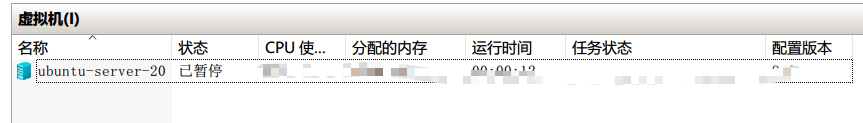
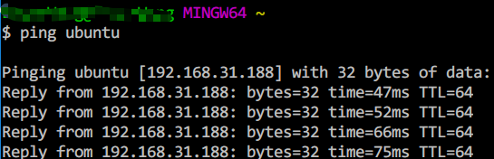

# develope-script-tools
For develope script tools

# For windows

- <a href="./windows/autoset-hyperip.ps1">autoset-hyperip.ps1</a> : will be auto-set host-ip pair in local hosts file for local vm.

- <a href="./windows/autoset-remote-ubuntu-id-local.ps1">autoset-hyperip.ps1</a> : will be auto-set host-ip pair in local hosts file for remote host.you can using `ping ubuntu` to check it

# For Mysql

- <a href="database\mysql\fetch_block_wait_info.sql">fetch_block_wait_info.sql</a> : show the block-wait threads